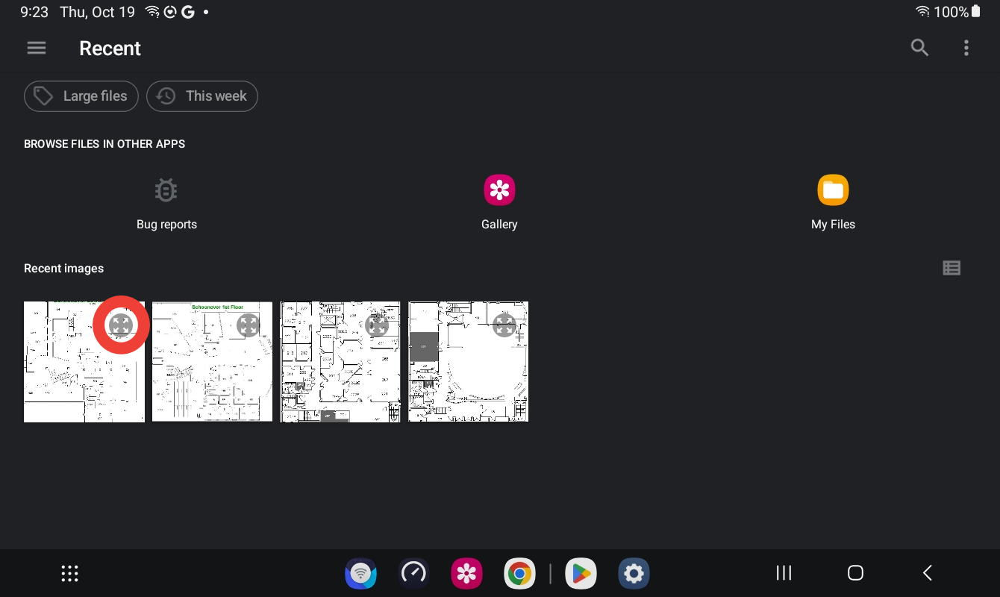
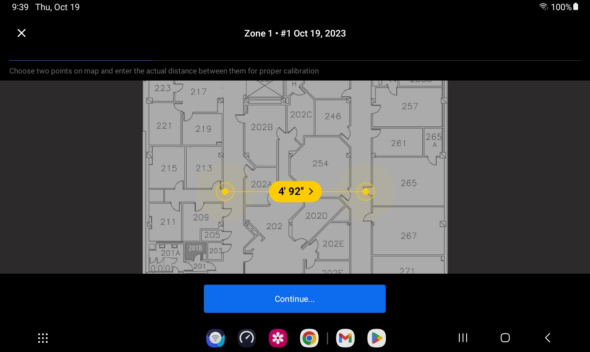
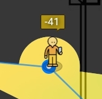
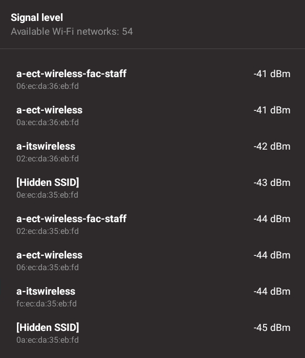
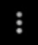

## WiFi Signal Strength Mapping

### Goals 
- Using provided tablets work alone or in teams to map out the WiFi signal strength of one or more floors of RTVC or SCHN.

### Pre-Lab
-   Dr. Bowie's lecture on Wi-Fi signal strength mapping
-  [ECT Tech Nugget - N35.0 - Wi-Fi Signal Mapping](https://youtu.be/Z-_h9zJS2BA?si=SeS8q0nzJ9zkNWcV) 

### Resources
-   ECT Dept provided tablet

### Task 0 - Destruction of University Lab Machines
Please note that this work is done on university equipment so YOUR equipment doesn't get broken and become non-functional. Please don't TRY and break the lab machines... however, that is their purpose is to have students do weird things with them. 

TL;DR - Try not to break the lab machines, but don't worry too much if something goes off the rails. Get and instructor and we'll help fix it. (Learning Moment!)

### Task 1 - NetApp Project Setup

1. Using the provided tablet, unlock it with the code: 1000

2. Open the app called "NetApp" on the bottom tool bar.

3. Select "Create new heat map" option and "Add Existing photo of a map.." option.

4. This will show a listing of several thumbnails of floor plans. Unfortunately they are VERY hard to figure out which one is which. Using the expand icon on the thumbnail (outlined in red in the image below) you can see the full image. All of the floor plans have titles. Find the floor plan for the floor you are mapping and select it.

    If using the expand option to examine a floor plan use the back arrow  in the lower left corner to go back to the full listing of thumbnails.

    

5. When prompted provide a name for the project. Adding the name of the floor you are mapping is a good idea.

### Task 2 - Project Settings

6. NetApp will show the floor plan image select and require the use provide a scale for the floor plan. Orient yourself to the floor plan and find a location that you can use to measure a distance. Find that distance by using a tape measure (ask the instructor) or using a known distance (e.g. the width of a door is usually 3 feet / 36 inches).

7. Using the yellow ruler icon in the lower right corner, select the ruler icon and then select two points on the floor plan are the location and distance you measured/selected. This will provide NetApp the correct scale for the floor plan.

8. Next set the scale to medium.

9. Drag the icon to a location on the floor plan that is easy to find and select. This will be the starting point for the mapping. You will need to move to that location before starting the scanning.

10. After scanning that square on the map move your self and the tablet to approximately the next square over on the map and scan again. Repeat this process until you have scanned the entire floor plan or as much as you can. Do not enter any rooms that are locked or you do not have permission to enter!

11. The application needs *at least* three points of data to provide any analysis. Once done scanning press the "Done" button.

12. Press the button labeled "WiFi heatmaps" that will generate the heat map.

### Task 3 - WiFi Heatmap Data Analysis

13. Once the heat map is generated you can move the avatar around the map to inspect data at different locations. Clicking on the various WiFi Access Points will provide more information about that Access Point.

14. Move the avatar to your current location **AND** make sure to place the avatar on top of one of the blue data points. The avatars icon will change (a tiny bit) and a number will appear over its heat the signal strength at that location.

15. Clicking on the person icon will provide a listing of the WiFi SSIDs and their signal strength at that location. 

16. At the bottom of the heatmap there's a menu option currently set to "Signal level" clicking on these words will allow for two additional options: "Signal-to-interference ratio" and "Signal-to-noise ratio". Selecting "Signal-to-noise ratio" and then clicking on the avatar again. This will provide a listing of the WiFi SSIDs and their signal-to-noise ratio at that location.

### Task 3 - Getting More Information

17. Using the "three dots" icon in the upper right corner. Select the option "Include/Exclude networks"

18. This menu allows the user to choose which SSIDs are shown in the map. Go through the list and de-select all EXCEPT the "OHIO University Guest" SSID. This will allow you to see the signal strength of the OHIO University Guest network. Use the back arrow in the upper left corner to go back to the heat map.

19. If the heat map does not have enough data or does not cover the area(s) of interest. Press the three buttons in the upper left corner of the screen. This will bring up a menu that allows the user to select the " Resume scanning" option. This will allow the user to continue scanning the floor plan and adding more data to the heat map.